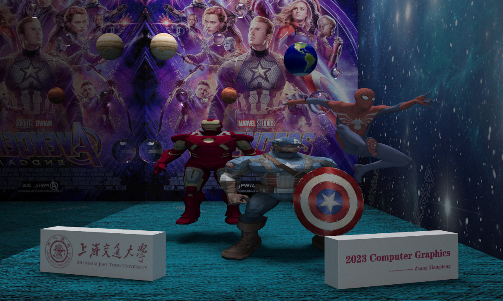

# 光线追踪个人项目
张祥东

## 项目环境配置
1. 参考Raytracing in one weekend的环境配置方法
2. 手动配置C++的 Assimp、OpenCV、threads 库

## 项目运行方法
1. mkdir build
2. cmake ..
    - 如果这一步有问题，考虑库没配置好或者路径不对，需要正确安装库或者如果库已经正确安装，请修正CMakeLists.txt文件
3. make 编译
4. ./main > image.ppm
    - 等待程序运行结束即可得到图片image.ppm
    - 运行速度慢可能和图片渲染品质相关，可以修改main.cpp顶部的图片品质
    - 编译之前，请更改main.cpp中的`std::string base_path = "/home/ahapbean/computer_graphics/final_ray_tracing/"`使其符合当前电脑的路径，即改为当前工作空间路径

## 项目特性
1. raytracing in one weekend系列书目前两本书的所有特性
2. 支持多线程渲染
3. 支持obj及相应纹理的导入
4. 实现了纹理插值

## 项目结果展示
最终作品如下


## 项目结构
```
├── CMakeLists.txt
├── README.md
├── final_scene.jpg
├── geometry
│   ├── box.h
│   ├── bvh.h
│   ├── hittable.h
│   ├── hittable_list.h
│   ├── sphere.h
│   ├── triangle.h
│   ├── volumn.h
│   └── xy_rect.h
├── main.cpp
├── material
│   ├── material.h
│   └── perlin.h
├── models
│   ├── avengers.jpg
│   ├── capitan
│   │   ├── CA_arm_leg_diff.tga
│   │   ├── CA_head_diff.tga
│   │   ├── CA_shield1_diff.tga
│   │   ├── CA_shield1_diff.tga:Zone.Identifier
│   │   ├── CA_shield2_diff.tga
│   │   ├── CA_shield2_diff.tga:Zone.Identifier
│   │   ├── CA_torso_hand_diff.tga
│   │   ├── Capitan.mtl
│   │   ├── Capitan.obj
│   │   ├── Capitan_shield.mtl
│   │   └── Capitan_shield.obj
│   ├── cg_word2.png
│   ├── earthmap.jpg
│   ├── ground.jpg
│   ├── ground2.jpg
│   ├── ground3.jpg
│   ├── iron_man
│   │   ├── IronMan_D.tga
│   │   ├── IronMan_E.tga
│   │   ├── IronMan_N.tga
│   │   ├── IronMan_S.tga
│   │   ├── Iron_Man.mtl
│   │   └── Iron_Man.obj
│   ├── jupiter.jpg
│   ├── mikky.jpg
│   ├── other_obj
│   │   ├── 1.obj
│   │   ├── 2.obj
│   │   ├── 3.obj
│   │   ├── Stick.obj
│   │   ├── cub.obj
│   │   ├── gold.jpeg
│   │   └── test.obj
│   ├── others
│   │   ├── CG_word(1).png
│   │   ├── CG_word.png
│   │   ├── book_summary
│   │   ├── cmake_tutorial
│   │   └── tutorial
│   ├── patrick_inverse
│   │   ├── patrick.jpg
│   │   ├── patrick.mtl
│   │   ├── patrick.obj
│   │   └── patrick.png
│   ├── school_badge.jpg
│   ├── spiderman
│   │   ├── spider.mtl
│   │   ├── spider.obj
│   │   ├── spider.png
│   │   ├── spider_eye.png
│   │   └── spider_mesh.png
│   ├── spiderman1
│   │   ├── spider.mtl
│   │   ├── spider.obj
│   │   └── spider.png
│   └── sun.jpg
├── scene
│   └── scene.h
├── texture
│   ├── texture.h
│   └── triangle_texture.h
└── utils
    ├── aabb.h
    ├── carmera.h
    ├── obj_loader.h
    ├── ray.h
    ├── rtweekend.h
    ├── stb_image.h
    └── vec3.h
```